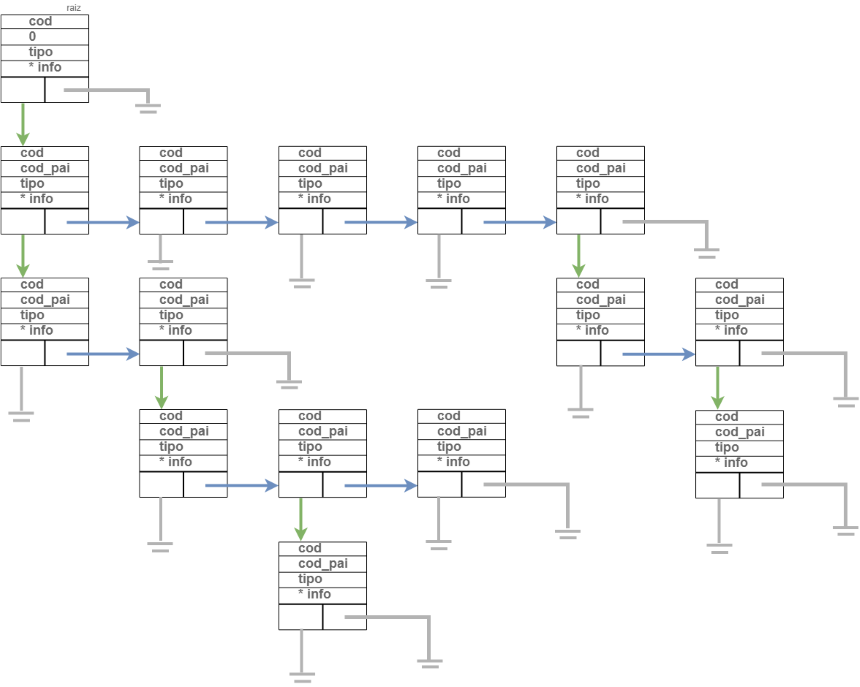
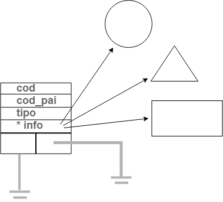

## Trabalho Computacional
### Estruturas de Dados e Algoritmos 2019-1

Implementação das funções de árvores genéricas no número de filhos, árvores n-árias, e no tipo de informação armazenada, testando com as seguintes figuras geométricas: círculo, quadrado, retângulo, trapézio e triângulo:

### 1. É permitido ao usuário do sistema: 
    (a) buscar figuras geométricas, por meio de um código único;
    (b) imprimir informações relevantes, tanto da árvore, quanto das figuras, incluindo-se sua área; 
    (c) inserir novas figuras; 
    (d) retirar figuras, passando seus descendentes para outro pai; 
    (e) destruir a árvore; e (f) alterar as dimensões de figuras;
    
### 2. É permitido ao usuário do sistema: transformar a árvore genérica numa árvore binária de busca balanceada, baseando-se no código único;
    
### 3. É ser permitido ao usuário do sistema: converter a árvore genérica numa árvore B, baseando-se no código único;
    
    Entrada: a entrada será fornecida por meio de arquivos texto. O arquivo texto é composto das seguintes informações, separadas por '/': código único, código único do pai (sendo que a raiz tem código do pai igual a zero) e as figuras geométricas, incluindo seu nome;

    as dimensões das figuras geométricas obedecem ao seguinte padrão: 
    (a) se a figura for um círculo ou um quadrado, uma única dimensão será informada (ou o raio, ou o lado, respectivamente); 
    (b) se a figura for um triângulo ou um retângulo, as duas dimensões informadas serão a base e a altura;
    (c) se a figura for um trapézio, três dimensões serão informadas, nessa ordem, base menor, base maior e altura;

### Exemplo de entrada do arquivo:    
```
1/0/TRI 3 2
2/1/RET 3 3
3/1/TRA 2 3 4
4/1/CIR 4
5/4/QUA 3
6/2/RET 2 2
7/5/TRA 1 2 3
8/5/CIR 2
9/4/QUA 1
10/1/TRI 1 2
```
    
### 4. a estrutura é totalmente destruída antes da execução ser finalizada.

### Imagem da estrutura da Árvore Genérica:



### Figuras:



### Comandos para executar o programa:


